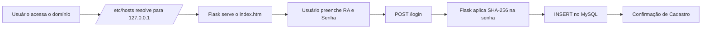
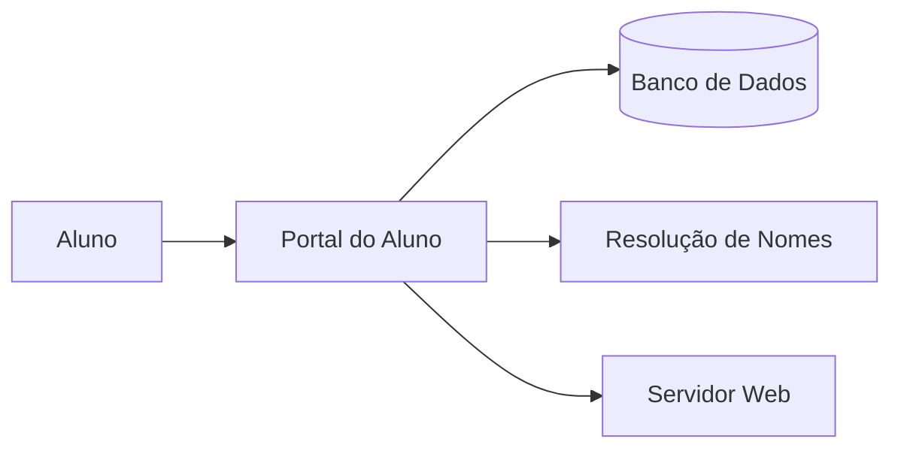
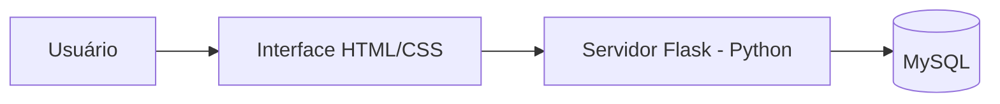
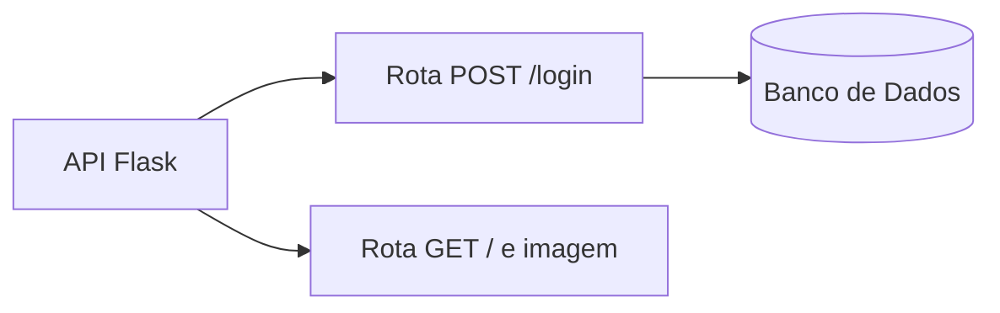

<h1 align="center"> Portal do Aluno </h1>

<p align="center">
Projeto desenvolvido durante a disciplina de Redes de Computadores.
</p>

<p align="center">
  <a href="#-projeto">Projeto</a>&nbsp;&nbsp;&nbsp;|&nbsp;&nbsp;&nbsp;
  <a href="#-tecnologias">Tecnologias</a>&nbsp;&nbsp;&nbsp;|&nbsp;&nbsp;&nbsp;
  <a href="#%EF%B8%8F-funcionalidades">Funcionalidades</a>&nbsp;&nbsp;&nbsp;|&nbsp;&nbsp;&nbsp;
  <a href="#-fluxo-do-sistema">Fluxo do Sistema</a>&nbsp;&nbsp;&nbsp;|&nbsp;&nbsp;&nbsp;
  <a href="#%EF%B8%8F-arquitetura-c4-model">Arquitetura (C4 Model)</a>&nbsp;&nbsp;&nbsp;|&nbsp;&nbsp;&nbsp;
  <a href="#-licença">Licença</a>
</p>

<p align="center">
  
  
  
</p>


<p align="center">
  
</p>

<br>

## 💻 Projeto

O Portal do Aluno é um sistema web de cadastro de estudantes desenvolvido para demonstrar na prática o funcionamento de uma aplicação full-stack, abordando conceitos de redes, servidores HTTP, autenticação e persistência de dados. O projeto simula um portal institucional com redirecionamento via `/etc/hosts`, servidor Flask e armazenamento seguro de credenciais em MySQL.

## 🚀 Tecnologias

Esse projeto foi desenvolvido com as seguintes tecnologias:

- Python
- Flask
- MySQL
- HTML e CSS
- Git e Github

## 🛠️ Funcionalidades

- **Cadastro de Alunos:** Registro de RA e senha com validação de campos obrigatórios.
- **Servidor Web Local:** Aplicação servida via Flask na porta 80 com suporte a arquivos estáticos.
- **Simulação de DNS:** Redirecionamento de domínio institucional via `/etc/hosts` para ambiente local.
- **Tratamento de Erros:** Feedback visual para RA duplicado, campos vazios e falhas de conexão.

## 🧭 Fluxo do Sistema



## 🏗️ Arquitetura (C4 Model)

### Contexto do Sistema



### Containers



### Componentes



## 📂 Estrutura do Projeto

```
redes-computadores-dns/
├── app.py                          # Servidor Flask
├── index.html                      # Interface do portal
└── photo.jpg  # Imagem de fundo
```

## ▶️ Como Executar

**1. Instalar dependências**
```bash
pip install flask mysql-connector-python
```

**2. Criar o banco de dados**
```bash
mysql -u root -p < banco.sql
```

**3. Configurar a senha do MySQL em `app.py`**
```python
DB_CONFIG = {
    "password": "sua_senha"
}
```

**4. Adicionar o domínio ao `/etc/hosts`**
```
127.0.0.1   portal.unicap.br
```

**5. Iniciar o servidor**
```bash
sudo python3 app.py
```

Acesse: `http://portal.unicap.br`

## 📝 Licença

Esse projeto está sob a licença MIT.